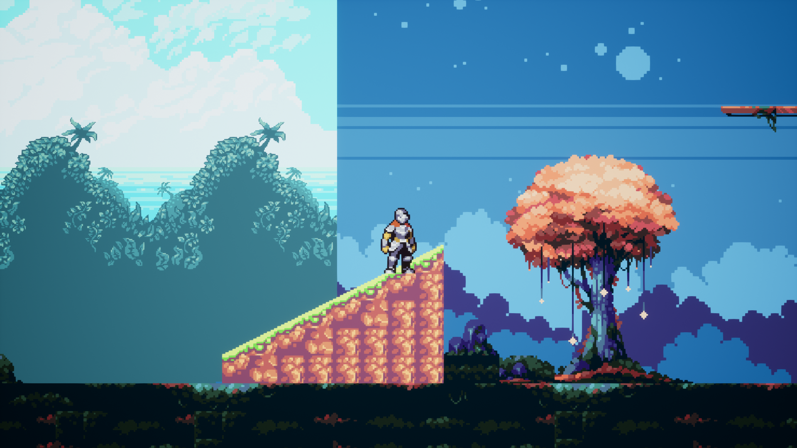

# Knightly
Knightly is a simple 2D game where a knight has to eliminate his enemies.

### **To play the game, please go to this game's [itch.io page](https://arcs84.itch.io/knightly)**

## Assets used:
Background Music: "The Verdant Grove" by Tallbeard Studios (Abstraction Music) (https://tallbeard.itch.io/music-loop-bundle)

Sprite Animations: "Fantasy Knight" by aamatniekss (https://aamatniekss.itch.io/fantasy-knight-free-pixelart-animated-character)

Sound Effects: Minifantasy - Dungeon Audio Pack by Leohpaz (https://leohpaz.itch.io/minifantasy-dungeon-sfx-pack)

Tiles: Stringstar Fields by Trixie (https://trixelized.itch.io/starstring-fields), and Sunny Land Pixel Game Art by ansimuz (https://ansimuz.itch.io/sunny-land-pixel-game-art)
